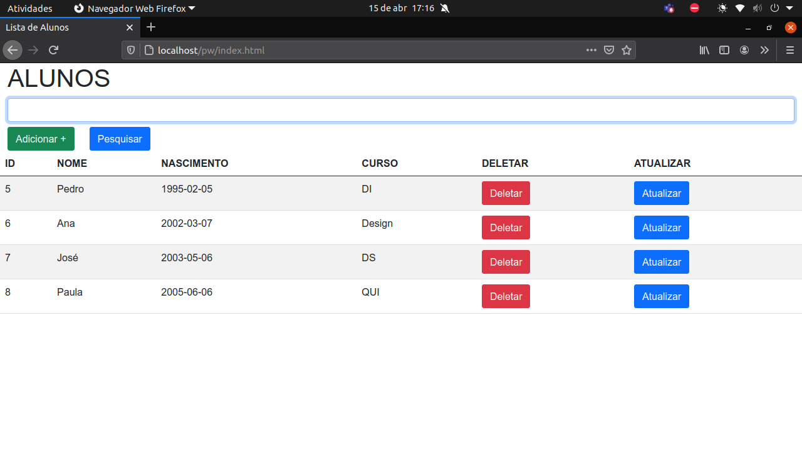
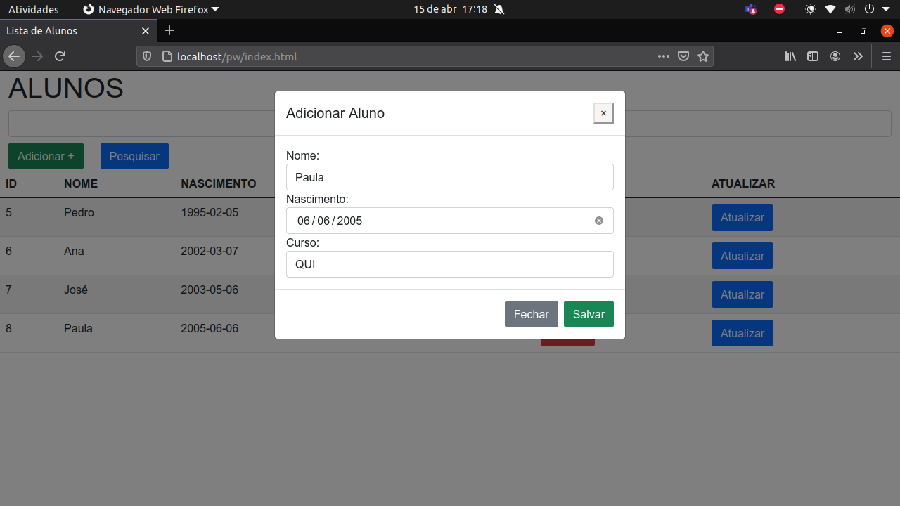
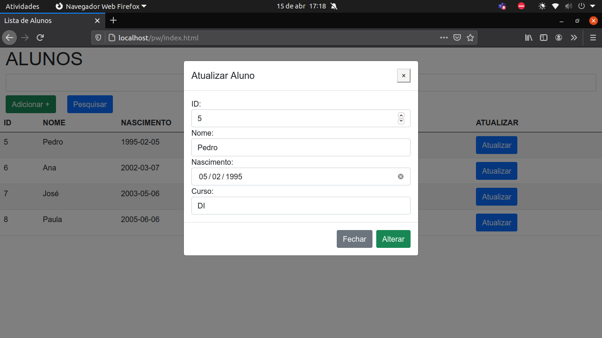

# school_crud

## Para que este projeto execute com sucesso é necessário que você crie o seguinte banco de dados em MySQL.

create database school;

use school;

create table students (

	id int not null auto_increment,
	name varchar(260) not null,
	birth date not null,
	career varchar(260) not null,
	primary key(id)

);

